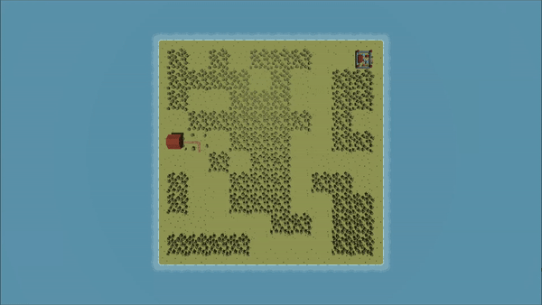
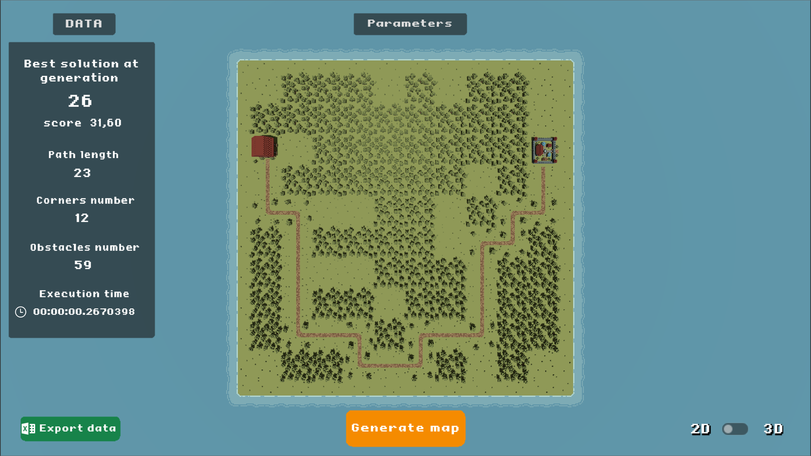
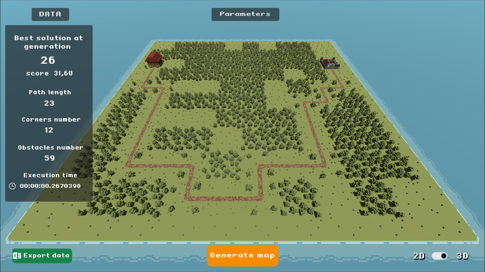
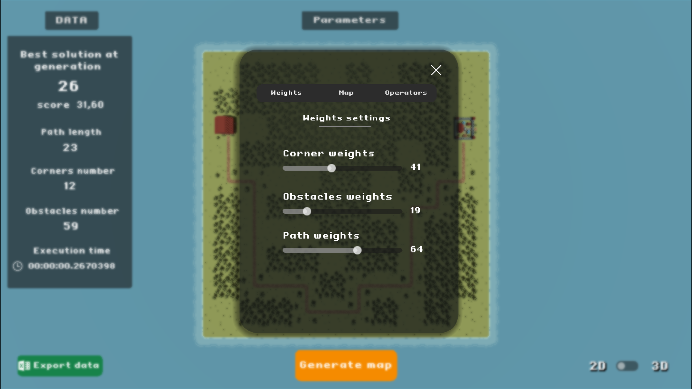
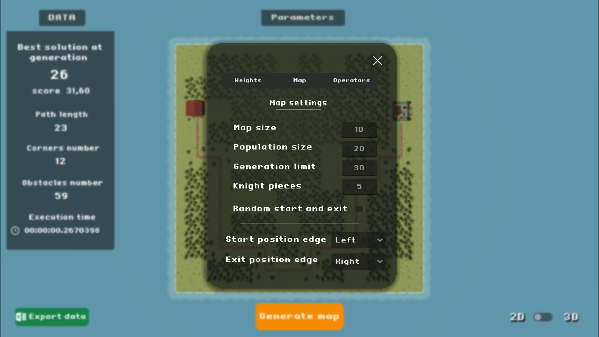
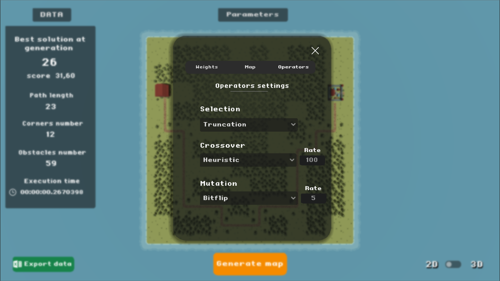

# Evopath:  Genetic algorithm for maps generation

## Overview

This project was developed as part of a university course on artificial intelligence (AI). The primary objective of the project was to apply the concepts and techniques learned throughout the course to a practical problem, fostering teamwork and enhancing our understanding of AI.

During the project, we implemented a genetic algorithm, which allowed us to explore optimal solutions through processes of selection, crossover, and mutation, demonstrating the effectiveness of this technique in solving complex problems.

We developed a genetic algorithm to generate maps with dynamic paths for use in tower defense games. Additionally, we developed a tool to configure and demonstrate various parameters, allowing us to obtain and analyze the map data effectively.

### Development Environment
The project was developed using the [Godot Engine](https://godotengine.org/), with a combination of C# and GDScript programming languages.

## Documentation

Full documentation can be found here: *TBD*

## Installation

- Download the [latest release](https://github.com/Gianpyy/evopath/releases) of the project
- Extract the files in a folder
- Run `Evopath.exe`

## Usage

### UI
- Press <b> Generate map </b> to generate a new map.
- Use <b> Export data </b> to save the map data into an Excel file.
- In the <b> Parameters </b> menu can be set the genetic algorithm parameters and map settings.
- The <b> Data </b> window shows the current map informations.

### Controls
- Switch between <b>2D</b> and <b>3D</b> using the button on the bottom right.
- Use <b>WASD</b> to move the camera over the map.
- <b>Zoom In/Out </b>using the mouse scroll wheel.

## Screenshots

### Top down view

###  3D view

### Parameters settings

## Authors

The project was realized by [Gianpio Silvestri](https://github.com/Gianpyy) and [Claudio Buono](https://github.com/ClaudioBuono) in 2024.
